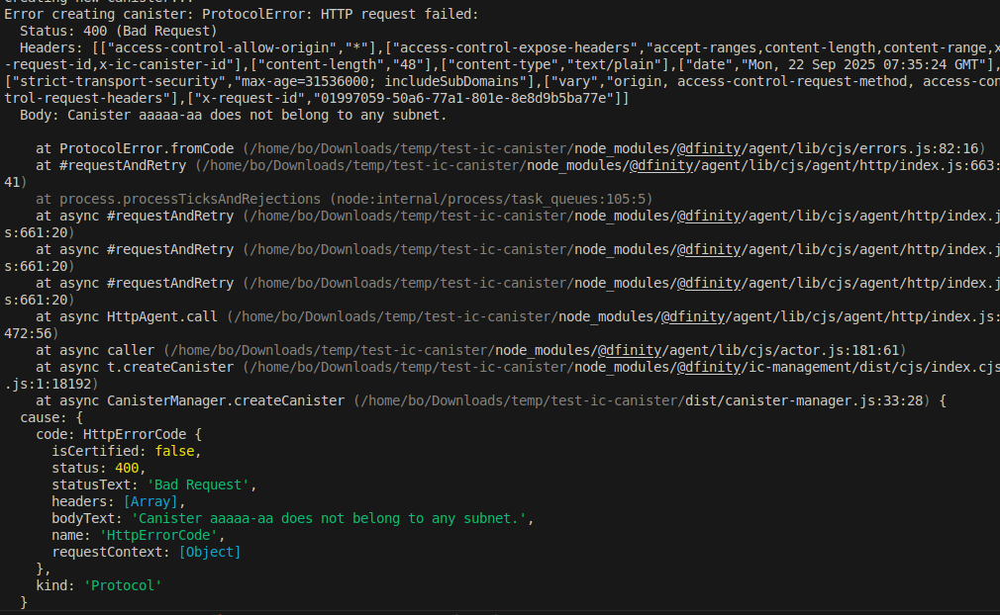

# IC Canister Creation with TypeScript Packages

This project demonstrates creating Internet Computer canisters using pure TypeScript and @dfinity packages, without relying on DFX commands for canister creation.

## Overview

This project aims to create IC canisters programmatically using TypeScript and the following packages:
- `@dfinity/agent` - HTTP agent for IC communication
- `@dfinity/ic-management` - IC management canister interface
- `@dfinity/identity` - Identity management
- `@dfinity/principal` - Principal utilities
- `@dfinity/candid` - Candid encoding/decoding

## Current Status

⚠️ **Known Issues**: The project currently encounters certificate validation errors when attempting to create canisters through TypeScript packages on local DFX replica.
Screenshot:


### Error Details

When running `npm run create-canister`, the following errors occur:

1. **Certificate Trust Error**:
   ```
   TrustError: The certificate contains a delegation that does not include the canister aaaaa-aa in the canister_ranges field
   ```

2. **Subnet Configuration Error**:
   ```
   Canister aaaaa-aa does not belong to any subnet
   ```

These errors suggest that the local DFX replica is not properly configured to handle management canister calls through the TypeScript agent.

## Installation

1. Install dependencies:
```bash
npm install
```

2. Build project:
```bash
npm run build
```

## Usage

### Start Local DFX Replica

```bash
dfx start --clean
```

### Attempt Canister Creation

```bash
npm run create-canister
```

## Project Structure

```
src/
├── canister-manager.ts    # Main canister management class
└── main.ts               # Demo script for canister creation
```

## Configuration

- **Local Host**: `http://127.0.0.1:4943`
- **Method**: `provisionalCreateCanisterWithCycles`
- **Cycles**: 1,000,000,000,000 (1T cycles)

## Troubleshooting

### Certificate Validation Issues

The current implementation faces certificate validation problems when communicating with the local DFX replica. This appears to be related to:

1. **Subnet Configuration**: The management canister (`aaaaa-aa`) is not properly configured in the local subnet
2. **Certificate Delegation**: The certificate validation process fails due to missing canister ranges
3. **Root Key Management**: Local development root key handling may need adjustment

### Potential Solutions Being Investigated

1. **Alternative Host Configuration**: Testing different ports (8080, 4943)
2. **Custom Fetch Implementation**: Bypassing default certificate validation
3. **Direct API Calls**: Using DFX HTTP endpoints directly
4. **Certificate Parsing**: Manual certificate parsing for canister ID extraction

## Working Verification

Despite the TypeScript package issues, canister creation works correctly using DFX commands:

```bash
dfx canister create --all
```

This confirms that:
- ✅ DFX replica is running correctly
- ✅ Local development environment is properly set up
- ❌ TypeScript package integration needs resolution

## Next Steps

1. **Root Cause Analysis**: Investigate local DFX replica configuration for management canister support
2. **Alternative Approaches**: Explore direct HTTP API calls to bypass certificate validation
3. **Certificate Handling**: Implement proper certificate parsing for local development
4. **Environment Compatibility**: Test with different DFX versions and configurations

## Goal

The ultimate goal is to achieve pure TypeScript-based canister creation without requiring DFX commands, enabling programmatic canister management in Node.js applications.

## Scripts

- `npm run build` - Compile TypeScript
- `npm run create-canister` - Attempt canister creation via TypeScript packages
- `npm run main` - Run the main demo script

## Dependencies

```json
{
  "@dfinity/agent": "^3.0.0",
  "@dfinity/candid": "^3.0.0",
  "@dfinity/ic-management": "^7.0.0",
  "@dfinity/identity": "^3.0.0",
  "@dfinity/principal": "^3.0.0",
  "@dfinity/utils": "^3.0.0",
  "isomorphic-fetch": "^3.0.0"
}
```

## Development Notes

This project represents an attempt to create IC canisters programmatically using TypeScript packages instead of relying on DFX CLI commands. While the approach is theoretically sound and the packages provide the necessary functionality, practical implementation faces challenges with local development environments.

The current blockers suggest that either:
1. Additional configuration is needed for local DFX replica
2. Alternative authentication/certificate approaches are required
3. Direct API integration might be more suitable for this use case

Contributions and suggestions for resolving these issues are welcome.
npm run dev
```
